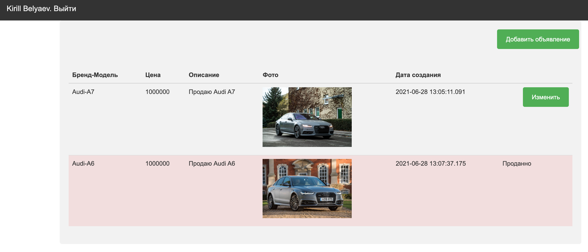
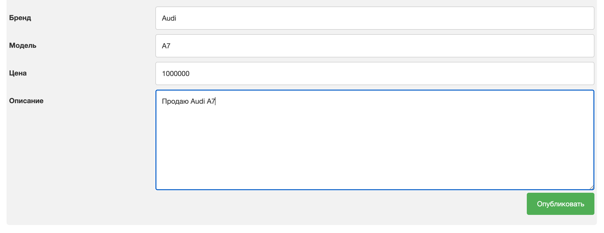

## Проект курса [job4j](http://job4j.ru)

### Площадка для продажи авто

Главная страница, где расположены авто для продажи или уже проданы.
Можно добавлять/изменять и отмечать что авто продан.
Необходимо зарегистрироваться чтобы добавить объявление. 
Каждый пользователь может менять только свое объявление.
Загрузка фото на отдельной страницы.

Технологии:
- PostgresSQL
- Hibernate
- Apache Tomcat
- Apache FileUpload
- Servlet
- JSP / CSS / JS / JSTL
- Ajax / Jquery
- Log4j
- JUnit
- Singleton (On Demand Holder Idom)

Главная страница авторизованного пользователя

Главная страница не авторизованного пользователя

Регистрация / авторизация

Добавление объяевления
